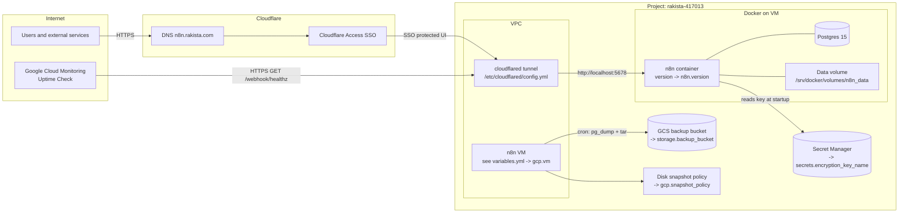

# Architecture Overview

> Constants come from `variables.yml` (do not hardcode). Health URL: see `n8n.health_url`.

## Five Key Points

1. **Ingress** — Public DNS (`cloudflare.domain`) points to Cloudflare; UI is **SSO**; `/webhook*` is **Bypass** for probes/integrations.  
2. **n8n on Docker** — Single container on VM `gcp.vm`, listening on **localhost:5678**; Cloudflared exposes it.  
3. **Secrets** — `secrets.encryption_key_name` in GSM; value never in git. n8n reads it at startup via env.  
4. **Data & backups** — Postgres 15 + n8n data volume under `/srv/docker/volumes/n8n_data`; backups to `storage.backup_bucket` (cron `pg_dump` and tar).  
5. **Resilience** — Disk snapshot policy `gcp.snapshot_policy` on `gcp.disk_name`; uptime check hits `n8n.health_url` every minute.
